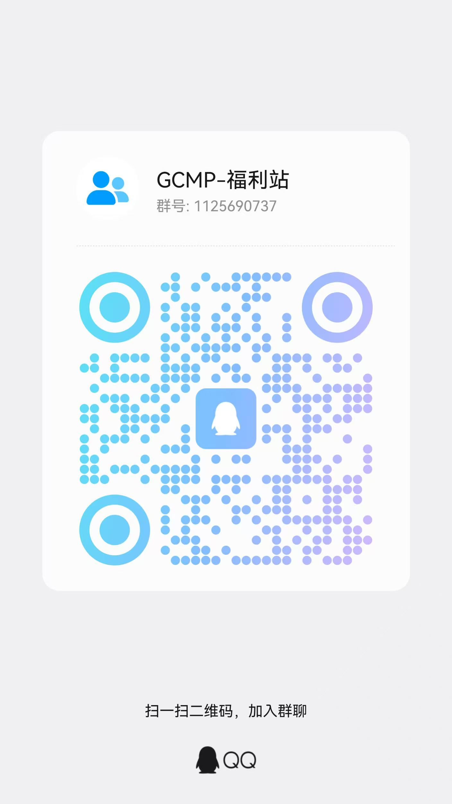

<h1 align="center">AI Coding 福利站导航</h1>

<p align="center">免费额度 · 白嫖 Claude Code / Codex / Cursor 的中转与公益站合集</p>

<p align="center">
  
  
  
  
</p>

<p align="center">
  <a href="https://agentrouter.org/register?aff=aibw"><b>AgentRouter 注册</b></a> ·
  <a href="https://docode.cc/register?aff=1Qof"><b>DoCode 注册</b></a> ·
  <a href="https://api.justwoker.icu/register?aff=OIWh"><b>JustDoWork 注册</b></a> ·
  <a href="https://kktoken.cc/sign-up?aff=JMQC"><b>KKtoken AI 注册</b></a> ·
  <a href="https://matrix.mzsjai.com/login?redirect=%2Fapp%2Fgrowth%3FinviteCode%3DMX3CDVGATLJW"><b>Matrix 注册</b></a> ·
  <a href="https://seekai.cc/sign-up?aff=dDJy"><b>SeekAi 注册</b></a> ·
  <a href="https://tabitoken.com/sign-up?aff=AfA4"><b>TaBiAI 注册</b></a> ·
  <a href="https://aaawinn.xyz/sign-up?aff=ijFL"><b>Long的AI 注册</b></a> ·
  <a href="https://api.hcnsec.cn/sign-up?aff=3J8z"><b>新疆幻城网安 注册</b></a> ·
  <a href="https://liangjiewis.com/register?aff=m3C1"><b>量界智算 注册</b></a>
</p>

<p align="center"><a href="https://q-shuang-dot.github.io/gcmp-welfare-temp/compare/">📊 按次 vs 按量折算横评</a> · <a href="https://q-shuang-dot.github.io/gcmp-welfare-temp/status/">🩺 可用性历史</a> · <a href="https://q-shuang-dot.github.io/gcmp-welfare-temp/changelog/">🗓 变动日志</a> · <a href="https://q-shuang-dot.github.io/gcmp-welfare-temp/feed.xml">🔔 Atom 订阅</a></p>

---

## 🧭 这个仓库有两部分

| 部分 | 是什么 | 入口 |
| :-- | :-- | :-- |
| 🛰 **GCMP Gateway** | 跑在你自己机器上的 AI 网关：多个逻辑模型、OpenAI / Anthropic / Responses 三协议全收、上游故障转移、配置热加载 | [部署文档](gcmp-gateway/README.md) · [详情页](https://q-shuang-dot.github.io/gcmp-welfare-temp/sites/gcmp-gateway/) |
| 🎁 **福利站导航** | 10 个第三方公益站 / 中转站的注册额度与实测状态，CI 每 6 小时自动抓取 | 本文件下面两张表 |

> 两件事互不依赖，只用其中一个也行；但把福利站领到的 key 填进网关，就能在一个地址里在 VS Code、Claude Code、Codex 之间换模型，不用各处改配置。

## 🛰 我的网关：GCMP Gateway

> 本地自托管 AI 网关 · 7 个逻辑模型，OpenAI / Anthropic / Responses 三协议全收，故障转移 + 热加载 + 本地管理页，没有额度焦虑

<a href="gcmp-gateway/README.md"></a>

**它和福利站不是一回事**：福利站是别人开的、你注册领额度；这个网关跑在你自己机器上，不发额度、没有邀请码、也不收你的钱——它把你手上（或上面那些站的）key 汇总成一个地址对外，一个逻辑模型挂多条上游，哪条挂了自动换下一条。

**为什么值得自托管**

- 你的网关你做主：部署在本机，没有注册链接、没有额度限制、没有账号被封的风险——上游 key 在你手里，随时换
- 多上游故障转移：opus-5 / gpt-5.6 / glm-5.3 / deepseek / cheap 等 7 个逻辑模型，一条挂了自动切下一条，比只挂一家免费站稳得多
- VS Code GCMP、Claude Code、Codex、OpenAI SDK 一套地址全搞定：/v1/chat/completions + /v1/responses + Anthropic /messages 三协议自带转换，不用自己写适配
- config.json 热加载，管理页可看路由命中、上游健康、请求统计与一键测试；响应头自带 X-Gateway-Upstream / X-Gateway-Model，排障一眼看到实际命中的上游

**7 个逻辑模型**（客户端只填逻辑模型名，具体走哪个上游由网关按路由与健康度决定）

| 逻辑模型 | 支持的协议 |
| :-- | :-- |
| `opus-5` | OpenAI / Responses / Anthropic |
| `opus-4-8` | OpenAI / Responses / Anthropic |
| `sonnet-5` | OpenAI / Responses / Anthropic |
| `gpt-5.6` | OpenAI / Responses |
| `glm-5.3` | OpenAI / Responses / Anthropic |
| `deepseek` | OpenAI / Responses / Anthropic |
| `cheap` | OpenAI / Responses / Anthropic |

**接入配置**（把 `127.0.0.1:15800` 换成你自己的监听地址）

<details><summary><b>VS Code GCMP</b></summary>

```json
{
  "gcmp.compatibleModels": [
    "opus-5",
    "opus-4-8",
    "sonnet-5",
    "gpt-5.6",
    "glm-5.3",
    "deepseek",
    "cheap"
  ],
  "gcmp.baseUrl": "http://127.0.0.1:15800/v1"
}
```

</details>
<details><summary><b>Claude Code</b></summary>

```bash
# macOS / Linux
export ANTHROPIC_BASE_URL=http://127.0.0.1:15800
export ANTHROPIC_AUTH_TOKEN=你的 GCMP Key
export ANTHROPIC_MODEL=glm-5.3
claude
```

</details>
<details><summary><b>Codex CLI</b></summary>

```toml
model = "gpt-5.6"
model_provider = "gcmp"

[model_providers.gcmp]
name = "GCMP Gateway"
base_url = "http://127.0.0.1:15800/v1"
env_key = "GCMP_API_KEY"
wire_api = "responses"
```

</details>
<details><summary><b>OpenAI SDK</b></summary>

```python
from openai import OpenAI

client = OpenAI(
    api_key="你的 GCMP Key",
    base_url="http://127.0.0.1:15800/v1",
)
resp = client.chat.completions.create(
    model="glm-5.3",
    messages=[{"role": "user", "content": "ping"}],
)
print(resp.choices[0].message.content)
```

</details>

**部署步骤**

1. clone 仓库并把 config.example.json 复制为 config.json
2. 按你的上游平台填入 apiKey，必要时按站点说明补 User-Agent / chatPath / protocol 等字段
3. 运行网关后浏览器打开 http://127.0.0.1:15800/admin 确认模型与路由状态
4. 客户端 Base URL 填 http://127.0.0.1:15800/v1，模型名填逻辑模型名

**⚠️ 使用前必读**

- 服务只监听 127.0.0.1:15800，不会自动暴露到公网；想让局域网设备使用需要自行代理或改监听地址
- 网关仅转发请求，模型质量、可用性与额度来自你配置的上游账号，不是这个仓库本身提供的
- config.json 里若配置了中文上游名，需要网关对 HTTP 头做 latin-1 安全转义，旧版本直接写中文头会被 latin-1 编码打断

**入口**

[完整部署文档](gcmp-gateway/README.md) · [英文说明](gcmp-gateway/README.en.md) · [详情页](https://q-shuang-dot.github.io/gcmp-welfare-temp/sites/gcmp-gateway/) · 控制台 <http://127.0.0.1:15800/admin> · [仓库](https://github.com/Q-shuang-dot/gcmp-welfare-temp)

---

## 🚀 一分钟上车（福利站）

> 下面两张表都是第三方站点，本仓库只做信息聚合；自己搭网关看上面那一节。

| 站点 | 状态 | 首日可得 | 额度构成 | 之后每天 | 兼容协议 | 模型 | 注册 | 邀请码 |
| :-- | :--: | :--: | :-- | :--: | :--: | :--: | :--: | :--: |
| **AgentRouter** 🔥 | 🟢 在线 | **$175** | 注册 $100 + 本页邀请 $50 + 首签 $25 | $25/天 | Anthropic + OpenAI | 6 个可查 | [点此注册 →](https://agentrouter.org/register?aff=aibw) | — |
| **DoCode** | 🟢 在线 | **300 站内刀** | 注册 50 站内刀 + 本页邀请 250 站内刀 | 无签到 | Anthropic + OpenAI | 需登录查看 | [点此注册 →](https://docode.cc/register?aff=1Qof) | `1Qof` |
| **JustDoWork** | 🟢 在线 | **≈$92** | 注册 $70 + 首签 ≈$22 | ≈$22/天 | Anthropic + OpenAI | 需登录查看 | [GitHub 注册 →](https://api.justwoker.icu/register?aff=OIWh) | — |
| **KKtoken AI** | 🟢 在线 | **$120** | 注册 $75 + 本页邀请 $25 + 首签 $20 | $20/天 | Anthropic + OpenAI | 需登录查看 | [GitHub 注册 →](https://kktoken.cc/sign-up?aff=JMQC) | — |
| **Matrix** | 🟢 在线 | **600 积分** | 本页邀请 600 积分 | — | OpenAI 兼容 | 需登录查看 | [点此注册 →](https://matrix.mzsjai.com/login?redirect=%2Fapp%2Fgrowth%3FinviteCode%3DMX3CDVGATLJW) | — |
| **SeekAi** | 🟢 在线 | 站内公示 | — | 支持签到 | OpenAI | 需登录查看 | [点此注册 →](https://seekai.cc/sign-up?aff=dDJy) | `dDJy` |
| **TaBiAI** | 🟢 在线 | **$120** | 注册 $100 + 本页邀请 $20 | 支持签到 | Anthropic + OpenAI | 4 个可查 | [GitHub 注册 →](https://tabitoken.com/sign-up?aff=AfA4) | — |
| **Long的AI** | 🟢 在线 | 站内公示 | — | 无签到 | Anthropic + OpenAI | 需登录查看 | [GitHub 注册 →](https://aaawinn.xyz/sign-up?aff=ijFL) | `ijFL` |
| **新疆幻城网安** | 🟢 在线 | 站内公示 | — | 支持签到 | Anthropic + OpenAI | 需登录查看 | [点此注册 →](https://api.hcnsec.cn/sign-up?aff=3J8z) | `3J8z` |
| **量界智算** | 🟢 在线 | 站内公示 | — | 支持签到 | Anthropic + OpenAI | 需登录查看 | [点此注册 →](https://liangjiewis.com/register?aff=m3C1) | `m3C1` |

> 「首日可得」= 注册基础额度 + 本页邀请链接额度 + 当天能领的签到额度（每日重置额度池的站点按一天的池子算）；模型、价格、在线状态由脚本抓取站点公开接口自动生成，最后更新：`2026-09-17 09:20 UTC`。
>
> 「邀请码」列写了码的站（DoCode `1Qof`、SeekAi `dDJy`、Long的AI `ijFL`、新疆幻城网安 `3J8z`、量界智算 `m3C1`），注册表单里有一栏要**自己填**，漏填就只拿得到注册基础额度、事后补不上；其余站写 — 是因为邀请额度由链接自带，不用手打。
>
> 8 个按美元计价、且还收新用户的站全注册一遍，第一天手上大约有 **$507** 额度可用；DoCode 另发 300 站内刀，Matrix 另发 600 积分，都是各站自己的计价单位、与美元没有公开换算，未计入这个合计。
>
> 🟡 有 2 个站点已超过 48 小时没抓到接口数据，其明细为上一次成功抓取的快照；在线状态按注册页实际可访问性判断。

**只想快点用上 Claude Code？** 三步：

1. 点上表的注册链接 → 按站点支持的方式登录（GitHub / 邮箱），额度是按邀请链接发放的，别走裸链
2. 后台「令牌 / API Keys」新建一个 Key
3. 跑一键脚本，或手抄下面对应站点的环境变量

```bash
# 交互式写好 Claude Code 的环境变量（macOS / Linux）
bash scripts/quickstart.sh
```

```powershell
# Windows PowerShell
powershell -ExecutionPolicy Bypass -File scripts/quickstart.ps1
```

## 📚 福利站详情


### 🟢 AgentRouter 🔥 首推

> AI Coding 公益站 · 注册即送额度，签到每日续命

<a href="https://agentrouter.org/register?aff=aibw"></a>

**为什么值得注册**

- 注册即送 $100，从本页邀请链接进入再多 $50，不需要充值、不需要信用卡
- 每日签到再领 $25，首日合计最高 $175，长期白嫖不断供
- 同时提供 Anthropic 与 OpenAI 两种兼容协议，Claude Code / Codex / Cline / Cursor 都能直连
- 官方文档覆盖十几种客户端，照着抄配置即可

**能拿多少额度**

- 注册即送：**$100**
- 从本页邀请链接注册额外：**$50**（站点接口实测一致）
- 每日签到：**$25/天**（长期续命的关键）
- 首日合计：**$175**　（注册 $100 + 本页邀请 $50 + 首签 $25）

**实时数据**（自动抓取站点公开接口）

- ⚠ 接口已连续 56 小时没抓到新数据，下列信息为 `2026-09-15 01:48 UTC` 的快照
- 站点名称：**Agent Router**
- 面板版本：`init-20260915-25158da5`
- 邀请他人可得：**$50**
- 登录方式：GitHub / LinuxDO
- 接口延迟：269 ms

**镜像 / 备用入口**

- 大陆备用域名：<https://ps.air-outer.com> · [从备用域名注册](https://ps.air-outer.com/register?aff=szt3)

**当前可用模型**

| 模型 | 倍率 | 输入 / 1M tokens | 输出 / 1M tokens | 协议 |
| :-- | :--: | :--: | :--: | :--: |
| `claude-opus-4-8` | 4 | $8 | $40 | anthropic / openai |
| `claude-opus-5` | 4 | $8 | $40 | anthropic / openai |
| `deepseek-v4-flash` | 2 | $4 | $12 | openai / anthropic |
| `glm-5.3` | 2.5 | $5 | $25 | anthropic / openai |
| `gpt-5.6-sol` | 1.5 | $3 | $15 | openai |
| `gpt-6-astra` | 1.5 | $3 | $15 | openai |

<sub>倍率 1 ≈ $2 / 1M tokens，输出价 = 倍率 × 补全倍率 × $2；以站内实时价格为准。</sub>

**注册要求**

- 务必从本页的邀请链接进入注册，否则拿不到邀请额度
- 注册成功后退出再重新登录一次，额度才会显示到账

**接入配置**

<details open><summary><b>Claude Code</b>（Anthropic 兼容，Base URL 不带 <code>/v1</code>）</summary>

```bash
# macOS / Linux
export ANTHROPIC_BASE_URL=https://agentrouter.org
export ANTHROPIC_AUTH_TOKEN=你在站点后台创建的 Key
export ANTHROPIC_MODEL=claude-opus-5
npm install -g @anthropic-ai/claude-code@latest && claude
```

```powershell
# Windows PowerShell
$env:ANTHROPIC_BASE_URL = "https://agentrouter.org"
$env:ANTHROPIC_AUTH_TOKEN = "你在站点后台创建的 Key"
$env:ANTHROPIC_MODEL = "claude-opus-5"
claude
```

</details>

<details><summary><b>Codex CLI</b>（OpenAI 兼容，写入 <code>~/.codex/config.toml</code>）</summary>

```toml
model = "gpt-6-astra"
model_provider = "agentrouter"

[model_providers.agentrouter]
name = "AgentRouter"
base_url = "https://agentrouter.org/v1"
env_key = "AGENTROUTER_API_KEY"
wire_api = "chat"
```

</details>

<details><summary><b>OpenAI SDK / Cherry Studio / Cursor 等通用客户端</b></summary>

```python
from openai import OpenAI

client = OpenAI(api_key="你的 Key", base_url="https://agentrouter.org/v1")
resp = client.chat.completions.create(model="gpt-6-astra", messages=[{"role": "user", "content": "ping"}])
print(resp.choices[0].message.content)
```

通用客户端只需填两项：**Base URL** = `https://agentrouter.org/v1`，**API Key** = 站点后台创建的 Key。

</details>

<details><summary><b>连通性自测</b></summary>

```bash
curl -s https://agentrouter.org/v1/chat/completions \
  -H "Authorization: Bearer $KEY" -H "Content-Type: application/json" \
  -d '{"model":"gpt-6-astra","messages":[{"role":"user","content":"只回复 OK"}]}'
```

</details>

**如何继续拿额度**

- 每日签到领额度（登录后台点签到）
- 绑定邮箱参与官方不定期抽奖兑换码
- 邀请他人注册，邀请人同样得额度

**⚠️ 使用前必读**

- 官方定位是公益站，不承诺 SLA、不支持充值；上游波动时可能临时停用某些模型
- 请求内容仅支持中 / 英 / 法 / 德 / 俄，其它语言会被拦截并返回 400
- 严禁批量注册、刷量、转售额度、虚假邀请，官方会直接封号

**官方渠道**

- Discord: https://discord.gg/aYq5B4RW3
- X: https://x.com/AgentRouter_0
- 邮箱: agent_router_org@163.com

<details><summary><b>站点最新公告</b>（自动同步）</summary>

- `2026-08-28` 为保障服务长期运行，Claude 和 GPT 模型已调整为限量供应，每日分批次发放，用完即止。目前暂定每日两批：北京时间 07:00 和 19:00（UTC 23:00 和 11:00），后续可能调整。 额度用完后会报错“402 Budget pool quota has been exhausted.”，等待下一批或切换至 DeepSeek / GLM 即可继续使用。
- `2026-07-28` 📢 备用域名正式上线 为进一步提升服务可用性，本站现已推出备用域名：🔗 https://ps.air-outer.com 访问不了原域名的中国大陆用户可使用此域名，备用域名支持 API 接口调用 与 官网访问，与原域名功能完全一致。 原域名 https://agentrouter.org 可继续使用。
- `2026-07-16` 🎁 官方社区平台汇总 欢迎加入或关注以下官方渠道，获取最新动态与支持： 📱 QQ 群（会定期清人，没进多试几次） · 1群：1054950616 · 2群：1091388133 · 3群：700583832 💬 Discord（有中文交流频道） https://discord.gg/HgekCyHJqB 🐦 X（Twitter） https://x.com/AgentRouter_0

</details>

---

### 🟢 DoCode

> New API 中转站 · 注册送 50 站内刀，注册时填邀请码 zMRe 再加 250，首日 300 刀，Claude 与 GPT 都在架上

<a href="https://docode.cc/register?aff=1Qof"></a>

**为什么值得注册**

- ⚠️ 别漏了邀请码：注册表单里的「邀请码」一栏填 zMRe，这 250 站内刀才会到账。从本页链接进去通常会自动带上，但提交前务必肉眼确认那一栏不是空的——没填就只有注册送的 50，事后补不上
- 注册送 50 站内刀，填了邀请码 zMRe 再加 250，首日 300 刀不用充值——注意这个「刀」是站内计价单位，不是美元，换算见下面的风险提示
- Claude 和 GPT 同时在架：站内公告点名 cc / cc-kiro 分组的 sonnet-5、按次计费的 opus4.6，以及 GPT pro / plus、Grok、Gemini、fable-5，一把 Key 通吃，本页多数站只给其中一边
- Anthropic 与 OpenAI 两条原生路由都开着（不带 key 探 /v1/messages 与 /v1/chat/completions 都回 New API 的 401 Invalid token），Claude Code 填 Base URL 就能直连，Codex CLI 走 /v1
- 面板公开配置里带着一键导入的 deeplink：CC Switch、Cherry Studio、DeepChat、OpenCat、Lobe Chat 等客户端可以从后台直接把 Key 推过去
- 主域名之外还有 api.docode.cc（公告写「直连美国」），实测两个入口都活着，主站进不去时可以换

**能拿多少额度**

- 注册即送：**50 站内刀**
- 从本页邀请链接注册额外：**250 站内刀**
- 首日合计：**300 站内刀**　（注册 50 站内刀 + 本页邀请 250 站内刀）

**实时数据**（自动抓取站点公开接口）

- 站点名称：**DoCode**
- 每日签到：❌
- 开放注册：✅
- 登录方式：账号密码
- 接口延迟：1108 ms

**镜像 / 备用入口**

- 直连美国：<https://api.docode.cc> · [从备用域名注册](https://api.docode.cc/register?aff=zMRe)

> 该站把定价页设成了登录可见（`/api/pricing` 返回 401，站点自己的导航配置里 pricing.requireAuth = true），本页不列模型表。站内公告点名在售的有 Claude（cc / cc-kiro 分组，sonnet-5 与按次计费的 opus4.6）、GPT pro / plus、Grok、Gemini、fable-5，另有独立的生图入口 img.docode.cc；完整清单、分组与倍率注册后在控制台「定价」页确认。

**注册要求**

- 邀请码 = zMRe。从本页链接进入（带 ?aff=zMRe）通常会自动填进注册表单的「邀请码」栏，提交前自己再看一眼；空着就只拿得到注册送的 50 站内刀
- 250 站内刀在注册那一刻结算，注册完再去后台补填邀请码是没用的
- 只能邮箱 + 密码建号：公开配置里 github / linuxdo / discord / telegram / 微信 / OIDC / Passkey 的开关全是 false，没有第三方登录入口
- 注册要邮箱验证码（email_verification = true），并且开着 Cloudflare Turnstile 人机校验
- 主域名打不开时换 api.docode.cc，同一套账号与额度

**接入配置**

<details open><summary><b>Claude Code</b>（Anthropic 兼容，Base URL 不带 <code>/v1</code>）</summary>

```bash
# macOS / Linux
export ANTHROPIC_BASE_URL=https://docode.cc
export ANTHROPIC_AUTH_TOKEN=你在站点后台创建的 Key
export ANTHROPIC_MODEL=<登录后台查看可用模型名>
npm install -g @anthropic-ai/claude-code@latest && claude
```

```powershell
# Windows PowerShell
$env:ANTHROPIC_BASE_URL = "https://docode.cc"
$env:ANTHROPIC_AUTH_TOKEN = "你在站点后台创建的 Key"
$env:ANTHROPIC_MODEL = "<登录后台查看可用模型名>"
claude
```

</details>

<details><summary><b>Codex CLI</b>（OpenAI 兼容，写入 <code>~/.codex/config.toml</code>）</summary>

```toml
model = "<登录后台查看可用模型名>"
model_provider = "docode"

[model_providers.docode]
name = "DoCode"
base_url = "https://docode.cc/v1"
env_key = "DOCODE_API_KEY"
wire_api = "chat"
```

</details>

<details><summary><b>OpenAI SDK / Cherry Studio / Cursor 等通用客户端</b></summary>

```python
from openai import OpenAI

client = OpenAI(api_key="你的 Key", base_url="https://docode.cc/v1")
resp = client.chat.completions.create(model="<登录后台查看可用模型名>", messages=[{"role": "user", "content": "ping"}])
print(resp.choices[0].message.content)
```

通用客户端只需填两项：**Base URL** = `https://docode.cc/v1`，**API Key** = 站点后台创建的 Key。

</details>

<details><summary><b>连通性自测</b></summary>

```bash
curl -s https://docode.cc/v1/chat/completions \
  -H "Authorization: Bearer $KEY" -H "Content-Type: application/json" \
  -d '{"model":"<登录后台查看可用模型名>","messages":[{"role":"user","content":"只回复 OK"}]}'
```

</details>

**如何继续拿额度**

- 站内没有签到（面板自报 checkin_enabled = false），额度靠充值和不定时活动，公告里出现过「充 100 送 500 刀」这类限时加码
- 邀请他人注册也有奖励，公告里提过 VIP 用户拉新额度从 80 上调至 120，具体金额登录后台「邀请」页确认

**⚠️ 使用前必读**

- 站内的「刀」不是美元：面板公开的 price = 0.02 就是充值比例，1 元 = 50 站内刀（公告里说平时恢复 1:25），而本页其它站是 ¥7.3 ≈ $1。所以 300 站内刀对应的充值面值只有 ¥6~12，本页也没把它并进跨站的美元合计
- 扣费还要再乘站内倍率：公告里 GPT pro 分组长期在 7~14 倍之间随上游号商价格来回调（New API 口径：倍率 1 = $2 / 百万 tokens）。按 13 倍粗算，300 站内刀约合一千万 tokens 量级的输入额度，输出还要乘补全倍率——量不算小，但一切以控制台实时倍率为准
- 额度数字（注册 50 / 邀请 250）站点公开接口没有暴露：/api/status 里既没有 quota_for_new_user 也没有 quota_for_invitee，本页登记的是站内公示口径，进后台核对一遍再算账
- 没有每日签到，额度用完只能充值或等活动，不像 AgentRouter 那样能每天续命
- 这是付费中转站不是公益站：后台开着在线充值（Stripe 单价 ¥8），公告里大半是充值送额度与倍率涨跌，免费额度用完要付费才能续
- 站内 FAQ 公示的备用域名 ai.docode.pro / ai.docode.life 与公告里的 hk.docode.cc 目前 HTTPS 都连不上（前两个的证书只签了 docode.cc、域名对不上，hk 直接 TLS 握手失败），本页只登记实测可用的 api.docode.cc
- 上游波动写在公告里：GPT plus「全面阵亡」后又「暂时复活」、gpt-5.4 已彻底下架、9 月 10 日还在说「openai 炸了，gpt 全线都不太行」，别当稳定生产通道用

<details><summary><b>站点最新公告</b>（自动同步）</summary>

- `2026-09-16` 现在免费用户体验期，可用模型作出如下调整，下架gpt模型，新上架grok，如有使用问题请联系管理
- `2026-09-15` 国模分组倍率下调，其中deepseek仅保留DeepSeek-V4.1-Flash与DeepSeek-V4-Pro-0813。
- `2026-09-10` 今天openai炸了，gpt全线都不太行，推荐用grok或者cc特殊分组

</details>

---

### 🟢 JustDoWork

> New API 中转站 · GitHub 一键登录，支持签到与绘图

<a href="https://api.justwoker.icu/register?aff=OIWh"></a>

**为什么值得注册**

- 注册即得约 $70 额度，GitHub 一键登录，不用充值
- 基于开源 New API 面板，控制台熟悉、日志与用量一目了然
- 每日签到再领约 $22，首日合计约 $92
- 支持对话之外的绘图 / 异步任务接口
- 一键把 Key 推送到 Cherry Studio、DeepChat、CC Switch 等客户端

**能拿多少额度**

- 注册即送：**$70**
- 每日签到：**≈$22/天**（长期续命的关键）
- 首日合计：**≈$92**　（注册 $70 + 首签 ≈$22）

**实时数据**（自动抓取站点公开接口）

- 站点名称：**JustDoWork**
- 面板版本：`v1.0.0-rc.23`
- 每日签到：✅
- 开放注册：✅（站点关掉了邮箱密码注册，得用 GitHub 登录建号（防批量注册的常规做法）。）
- 登录方式：GitHub / 账号密码
- GitHub 账号需满 **365 天**
- 接口延迟：1054 ms

> 该站模型清单需登录后台查看，注册后在「模型价格」页确认。

**注册要求**

- 已关闭账号密码注册，只能用 GitHub 授权登录
- GitHub 账号注册满 365 天才允许绑定，小号会被拒绝
- 注册页有 Turnstile 人机校验，需要能正常加载 Cloudflare 脚本
- 务必从本页邀请链接进入，注册后邀请额度才会算到位

**接入配置**

<details open><summary><b>Claude Code</b>（Anthropic 兼容，Base URL 不带 <code>/v1</code>）</summary>

```bash
# macOS / Linux
export ANTHROPIC_BASE_URL=https://api.justwoker.icu
export ANTHROPIC_AUTH_TOKEN=你在站点后台创建的 Key
export ANTHROPIC_MODEL=<登录后台查看可用模型名>
npm install -g @anthropic-ai/claude-code@latest && claude
```

```powershell
# Windows PowerShell
$env:ANTHROPIC_BASE_URL = "https://api.justwoker.icu"
$env:ANTHROPIC_AUTH_TOKEN = "你在站点后台创建的 Key"
$env:ANTHROPIC_MODEL = "<登录后台查看可用模型名>"
claude
```

</details>

<details><summary><b>Codex CLI</b>（OpenAI 兼容，写入 <code>~/.codex/config.toml</code>）</summary>

```toml
model = "<登录后台查看可用模型名>"
model_provider = "justdowork"

[model_providers.justdowork]
name = "JustDoWork"
base_url = "https://api.justwoker.icu/v1"
env_key = "JUSTDOWORK_API_KEY"
wire_api = "chat"
```

</details>

<details><summary><b>OpenAI SDK / Cherry Studio / Cursor 等通用客户端</b></summary>

```python
from openai import OpenAI

client = OpenAI(api_key="你的 Key", base_url="https://api.justwoker.icu/v1")
resp = client.chat.completions.create(model="<登录后台查看可用模型名>", messages=[{"role": "user", "content": "ping"}])
print(resp.choices[0].message.content)
```

通用客户端只需填两项：**Base URL** = `https://api.justwoker.icu/v1`，**API Key** = 站点后台创建的 Key。

</details>

<details><summary><b>连通性自测</b></summary>

```bash
curl -s https://api.justwoker.icu/v1/chat/completions \
  -H "Authorization: Bearer $KEY" -H "Content-Type: application/json" \
  -d '{"model":"<登录后台查看可用模型名>","messages":[{"role":"user","content":"只回复 OK"}]}'
```

</details>

**如何继续拿额度**

- 每日签到领约 $22
- 关注站点公告获取活动兑换码

**⚠️ 使用前必读**

- 模型清单与价格需要登录后台才能查看，本页不做承诺
- 中转站上游随时可能调整，请以站内实际价格与可用模型为准

---

### 🟢 KKtoken AI

> New API 中转站 · 注册送 $75，本页邀请码再加 $25，按 token 计费输入输出各 $1/M

<a href="https://kktoken.cc/sign-up?aff=JMQC"></a>

**为什么值得注册**

- 注册送 $75，从本页邀请链接进入再加 $25，每日签到再领 $20，首日合计 $120
- 按 token 计费：输入 $1 / 百万 tokens、输出 $1 / 百万 tokens，和本页那几个「每次 $0.3」的按次站不是一套口径，长对话更划算
- Anthropic 与 OpenAI 两条原生路由都开着（未鉴权探测 /v1/messages 与 /v1/chat/completions 都已就位），Claude Code 填个 Base URL 就能直连——具体上了哪些模型要登录后台确认
- 面板开着每日签到、绘图与异步任务接口，控制台就是熟悉的 New API（站点自报 KKtoken AI v1.0.0-rc.25）

**能拿多少额度**

- 注册即送：**$75**
- 从本页邀请链接注册额外：**$25**
- 每日签到：**$20/天**（长期续命的关键）
- 首日合计：**$120**　（注册 $75 + 本页邀请 $25 + 首签 $20）

**实时数据**（自动抓取站点公开接口）

- 站点名称：**KKtoken AI**
- 面板版本：`v1.0.0-rc.25`
- 每日签到：✅
- 开放注册：✅（站点关掉了邮箱密码注册，得用 GitHub 登录建号（防批量注册的常规做法）。）
- 登录方式：GitHub / 账号密码
- 接口延迟：1275 ms

> 该站把价格页设成了登录可见（`/api/pricing` 返回 401），本页不列模型表。站内公示的计价口径是输入 $1 / 百万 tokens、输出 $1 / 百万 tokens，按 token 而不是按次，注册后在控制台「模型价格」页确认实际清单与倍率。

**注册要求**

- 务必从本页邀请链接进入注册（带 ?aff=MzG9），$25 在注册那一刻结算，事后补不上
- GitHub 账号注册满 1 年（365 天）才允许绑定，小号会被拒绝
- 已关闭账号密码注册，只能用 GitHub 授权；注册完成后可以再设密码用于登录
- 注册页有 Cloudflare Turnstile 人机校验，需要能正常加载 Cloudflare 脚本

**接入配置**

<details open><summary><b>Claude Code</b>（Anthropic 兼容，Base URL 不带 <code>/v1</code>）</summary>

```bash
# macOS / Linux
export ANTHROPIC_BASE_URL=https://kktoken.cc
export ANTHROPIC_AUTH_TOKEN=你在站点后台创建的 Key
export ANTHROPIC_MODEL=<登录后台查看可用模型名>
npm install -g @anthropic-ai/claude-code@latest && claude
```

```powershell
# Windows PowerShell
$env:ANTHROPIC_BASE_URL = "https://kktoken.cc"
$env:ANTHROPIC_AUTH_TOKEN = "你在站点后台创建的 Key"
$env:ANTHROPIC_MODEL = "<登录后台查看可用模型名>"
claude
```

</details>

<details><summary><b>Codex CLI</b>（OpenAI 兼容，写入 <code>~/.codex/config.toml</code>）</summary>

```toml
model = "<登录后台查看可用模型名>"
model_provider = "kktoken"

[model_providers.kktoken]
name = "KKtoken AI"
base_url = "https://kktoken.cc/v1"
env_key = "KKTOKEN_API_KEY"
wire_api = "chat"
```

</details>

<details><summary><b>OpenAI SDK / Cherry Studio / Cursor 等通用客户端</b></summary>

```python
from openai import OpenAI

client = OpenAI(api_key="你的 Key", base_url="https://kktoken.cc/v1")
resp = client.chat.completions.create(model="<登录后台查看可用模型名>", messages=[{"role": "user", "content": "ping"}])
print(resp.choices[0].message.content)
```

通用客户端只需填两项：**Base URL** = `https://kktoken.cc/v1`，**API Key** = 站点后台创建的 Key。

</details>

<details><summary><b>连通性自测</b></summary>

```bash
curl -s https://kktoken.cc/v1/chat/completions \
  -H "Authorization: Bearer $KEY" -H "Content-Type: application/json" \
  -d '{"model":"<登录后台查看可用模型名>","messages":[{"role":"user","content":"只回复 OK"}]}'
```

</details>

**如何继续拿额度**

- 每日签到领 $20（登录后台点签到）
- 邀请他人注册也有奖励，金额站点公开接口没公示，登录后台「邀请」页确认

**⚠️ 使用前必读**

- 额度数字（注册 $75 / 邀请 $25 / 签到 $20）站点公开接口没有暴露——它的 /api/status 里既没有 quota_for_new_user 也没有 quota_for_invitee，本页登记的是站内公示口径，进后台核对一下再算账
- 模型清单与价格要登录才能看（/api/pricing 返回 401），$1/M 的输入输出价同样以站内为准，本页不做承诺
- 站点支持在线充值（站内公示 $1 ≈ ¥7.3，Stripe 通道 ¥8），是中转站不是纯公益站，免费额度用完要付费才能续
- 站点前面挂着 Cloudflare，机房 IP 容易被拦，本页的自动探测偶尔会标「被 WAF 拦下」，不代表站点对你不可用

---

### 🟢 Matrix

> 统一 API 网关 + 开源应用商店 · 邀请注册送 600 积分，实名再送 2000

<a href="https://matrix.mzsjai.com/login?redirect=%2Fapp%2Fgrowth%3FinviteCode%3DMX3CDVGATLJW"></a>

**为什么值得注册**

- 从本页邀请链接注册即得 600 获赠积分，注册就发、不用实名、不用充值
- 完成个人实名认证再领 2,000 积分，是这个站拿额度最快的一步
- 一把 Key 调通 OpenAI / Anthropic / Google / DeepSeek / Moonshot / 智谱 / 阿里 等多家模型，OpenAI 兼容协议直连 Cursor / Cherry Studio / Open WebUI / Aider
- 自带开源应用商店，登录后一键拉起独立容器实例，容器内的 AI 调用自动走你的 Matrix Key

**能拿多少额度**

- 从本页邀请链接注册额外：**600 积分**
- 首日合计：**600 积分**

**实时数据**（自动抓取站点公开接口）

- 接口延迟：1954 ms

> 模型清单与价格需登录后在控制台「模型列表」查看（按每百万 Tokens 计价，可按厂商 / 上下文窗口筛选），站点没有公开的模型与定价接口，本页不做承诺。

**注册要求**

- 务必从本页邀请链接进入注册（带 inviteCode），奖励仅对新用户首次注册有效，否则 600 积分不发放
- 被邀请者注册即得 600 获赠积分，不要求先实名；2,000 积分的实名奖励要自己去钱包页领取
- 同一用户 / 同一实名主体只能领一次实名奖励；异常注册、重复绑定邀请关系不发奖

**接入配置**

> 官方文档把网关地址写成占位符「<Matrix 网关地址>/v1」，并注明当前地址只显示在登录后的 API Key 详情页，本页不做猜测。

1. 从本页邀请链接注册并登录（杭电统一身份认证 / 手机验证码 / 邮箱 + 密码 任选一种）
2. 进入控制台「API Key」新建一把 Key：Token 以 mat- 开头且只显示一次，复制好；同一页面能看到当前网关地址
3. 客户端里填 Base URL = 网关地址 + /v1、API Key = 刚复制的 mat- Key，模型名到控制台「模型列表」页确认

控制台入口：<https://matrix.mzsjai.com/app/apikey>

**如何继续拿额度**

- 完成个人实名认证，在钱包页领 2,000 积分（一次性）
- 邀请好友注册，邀请者与被邀请者各得 600 积分 / 人
- 站内「反馈赢兑换码」：建议被采纳会送额度
- 注册后钱包里还有一笔初始体验额度，站方没公示具体数目，本页不计入合计

**⚠️ 使用前必读**

- 额度是站内积分，站方没有公开积分与美元的换算，本页按积分原样显示，不折算美元、也不并入跨站的美元合计
- 活动奖励发的是「获赠积分」，长期有效，但只能调用支持获赠积分的模型与平台服务
- 增长活动官方写明有效期至 2026 年 12 月 31 日，之后规则可能调整
- 只提供 OpenAI 兼容协议，官方文档没有 Anthropic 原生接口，Claude Code 不能直连（要用得自己做协议转换）
- 应用商店的容器实例按规格 × 运行时长计费，体验完记得在控制台关停 / 删除，否则会一直扣额度
- 站内的 Qoder 订阅、充值等是付费商品，注意与免费活动奖励区分
- 实名认证要提交个人身份信息，为 2,000 积分做不做这一步请自行判断

**官方渠道**

- 文档: https://matrix.mzsjai.com/docs/quickstart
- 反馈: https://matrix.mzsjai.com/docs/contact

---

### 🟢 SeekAi

> New API 中转站 · 注册送额度，签到与邀请持续续命，支持 Claude Code / Codex / Cursor

<a href="https://seekai.cc/sign-up?aff=dDJy"></a>

**为什么值得注册**

- 新用户注册即送可用余额，站方称默认额度足够免费用半年，邀请人与被邀请人都有奖励
- 每日签到已开启，登录后台点签到即可持续续命
- 支持邮箱密码、GitHub、Telegram 三种登录方式，注册需要邮箱验证码并通过 Cloudflare Turnstile 人机校验
- OpenAI 兼容协议直连 Claude Code / Codex / Cursor / Cherry Studio 等主流客户端

**实时数据**（自动抓取站点公开接口）

- 站点名称：**SeekAi**
- 面板版本：`v1.0.0-rc.25`
- 每日签到：✅
- 开放注册：✅
- 登录方式：GitHub / Telegram / 账号密码
- 接口延迟：1563 ms

**镜像 / 备用入口**

- API 域名：<https://api.hcnsec.cn> · [从备用域名注册](https://api.hcnsec.cn/sign-up?aff=3J8z)

> 模型清单与价格需登录后在控制台「模型广场」查看，公开接口不暴露具体模型与定价；站内公告提到 Claude / DeepSeek / GPT / Gemini / Step 等多类模型。

**注册要求**

- 务必从本页邀请链接进入注册（带 ?aff=dDJy），邀请额度才会发放
- 注册需要邮箱验证码，并经过 Cloudflare Turnstile 人机校验
- 新用户注册即送默认余额，同时可通过邀请、签到、任务继续获取额度

**接入配置**

<details><summary><b>Codex CLI</b>（OpenAI 兼容，写入 <code>~/.codex/config.toml</code>）</summary>

```toml
model = "<登录后台查看可用模型名>"
model_provider = "seekai"

[model_providers.seekai]
name = "SeekAi"
base_url = "https://seekai.cc/v1"
env_key = "SEEKAI_API_KEY"
wire_api = "chat"
```

</details>

<details><summary><b>OpenAI SDK / Cherry Studio / Cursor 等通用客户端</b></summary>

```python
from openai import OpenAI

client = OpenAI(api_key="你的 Key", base_url="https://seekai.cc/v1")
resp = client.chat.completions.create(model="<登录后台查看可用模型名>", messages=[{"role": "user", "content": "ping"}])
print(resp.choices[0].message.content)
```

通用客户端只需填两项：**Base URL** = `https://seekai.cc/v1`，**API Key** = 站点后台创建的 Key。

</details>

<details><summary><b>连通性自测</b></summary>

```bash
curl -s https://seekai.cc/v1/chat/completions \
  -H "Authorization: Bearer $KEY" -H "Content-Type: application/json" \
  -d '{"model":"<登录后台查看可用模型名>","messages":[{"role":"user","content":"只回复 OK"}]}'
```

</details>

**如何继续拿额度**

- 每日签到领额度（登录后台点签到）
- 邀请他人注册，邀请人与被邀请者都能获得额度
- 关注站内公告，不定期开放任务与活动兑换码

**⚠️ 使用前必读**

- 免费用户高峰时段会限速或遇到模型不可用，站方建议深夜或凌晨挂长任务，白天优先使用 step / auto / qwen3.6 等小模型
- 额度是站内余额，公开接口没有美元换算，本页只做定性描述，不做美元折算
- 模型可用性与价格会随上游调整，以控制台实时页面为准
- 站点备案主体为新疆幻城网安科技，运营主体与同域名下的建站业务共用同一备案主体

**官方渠道**

- Telegram: https://t.me/ModelFreeApi
- 邮箱: yangyuqi@xjhcit.cn
- QQ群: 94355225

---

### 🟢 TaBiAI

> New API 中转站 · 注册送 $100，本页邀请码再加 $20，专供 Claude Opus

<a href="https://tabitoken.com/sign-up?aff=AfA4"></a>

**为什么值得注册**

- 新用户注册送 $100，从本页邀请链接进入再加 $20，首日 $120（2026-08-30 实测到账）
- Anthropic 与 OpenAI 两种协议都开着，Claude Code 填个 Base URL 就能直连
- 只放 Claude Opus 四个型号（opus-5 / opus-5-thinking / opus-4-8 / 4-8-thinking），定价接口公开可查
- 面板开着每日签到，可以持续领额度

**能拿多少额度**

- 注册即送：**$100**
- 从本页邀请链接注册额外：**$20**
- 首日合计：**$120**　（注册 $100 + 本页邀请 $20）

**实时数据**（自动抓取站点公开接口）

- ⚠ 接口已连续 277 小时没抓到新数据，下列信息为 `2026-09-05 20:22 UTC` 的快照
- 站点名称：**TaBiAI**
- 面板版本：`init-20260817-f880a343`
- 每日签到：✅
- 开放注册：✅（站点关掉了邮箱密码注册，得用 GitHub 登录建号（防批量注册的常规做法）。）
- 登录方式：GitHub / 账号密码
- 接口延迟：162 ms

**当前可用模型**

| 模型 | 倍率 | 输入 / 1M tokens | 输出 / 1M tokens | 协议 |
| :-- | :--: | :--: | :--: | :--: |
| `claude-opus-4-8` | 按次 | **$0.5 / 次** | — | anthropic / openai |
| `claude-opus-4-8-thinking` | 按次 | **$0.5 / 次** | — | anthropic / openai |
| `claude-opus-5` | 按次 | **$0.35 / 次** | — | anthropic / openai |
| `claude-opus-5-thinking` | 按次 | **$0.4 / 次** | — | anthropic / openai |

<sub>标「按次」的模型按请求次数计费，与 tokens 用量无关；其余倍率 1 ≈ $2 / 1M tokens。以站内实时价格为准。</sub>

**注册要求**

- 务必从本页邀请链接进入注册（带 ?aff=EQIT），$20 在注册那一刻结算，事后补不上
- 已关闭账号密码注册，只能用 GitHub 授权；注册完成后可以再设密码用于登录
- 注册页有 Cloudflare Turnstile 人机校验，需要能正常加载 Cloudflare 脚本

**接入配置**

<details open><summary><b>Claude Code</b>（Anthropic 兼容，Base URL 不带 <code>/v1</code>）</summary>

```bash
# macOS / Linux
export ANTHROPIC_BASE_URL=https://tabitoken.com
export ANTHROPIC_AUTH_TOKEN=你在站点后台创建的 Key
export ANTHROPIC_MODEL=claude-opus-5
npm install -g @anthropic-ai/claude-code@latest && claude
```

```powershell
# Windows PowerShell
$env:ANTHROPIC_BASE_URL = "https://tabitoken.com"
$env:ANTHROPIC_AUTH_TOKEN = "你在站点后台创建的 Key"
$env:ANTHROPIC_MODEL = "claude-opus-5"
claude
```

</details>

<details><summary><b>Codex CLI</b>（OpenAI 兼容，写入 <code>~/.codex/config.toml</code>）</summary>

```toml
model = "claude-opus-5"
model_provider = "tabitoken"

[model_providers.tabitoken]
name = "TaBiAI"
base_url = "https://tabitoken.com/v1"
env_key = "TABITOKEN_API_KEY"
wire_api = "chat"
```

</details>

<details><summary><b>OpenAI SDK / Cherry Studio / Cursor 等通用客户端</b></summary>

```python
from openai import OpenAI

client = OpenAI(api_key="你的 Key", base_url="https://tabitoken.com/v1")
resp = client.chat.completions.create(model="claude-opus-5", messages=[{"role": "user", "content": "ping"}])
print(resp.choices[0].message.content)
```

通用客户端只需填两项：**Base URL** = `https://tabitoken.com/v1`，**API Key** = 站点后台创建的 Key。

</details>

<details><summary><b>连通性自测</b></summary>

```bash
curl -s https://tabitoken.com/v1/chat/completions \
  -H "Authorization: Bearer $KEY" -H "Content-Type: application/json" \
  -d '{"model":"claude-opus-5","messages":[{"role":"user","content":"只回复 OK"}]}'
```

</details>

**如何继续拿额度**

- 面板已开启每日签到，登录后台点签到即可（每次给多少站点没公示，以站内为准）
- 邀请他人注册也有奖励，金额站点未公开，登录后台「邀请」页确认

**⚠️ 使用前必读**

- 按次计费而不是按 token：claude-opus-5 / -thinking 每次 $0.8，claude-opus-4-8 系每次 $0.5。首日 $120 约等于 150 次 opus-5 请求，Claude Code 里一问一答就算一次，比按 token 的站消耗快得多
- 只有 Claude Opus 四个模型，没有 GPT / Gemini；OpenAI 兼容协议虽然开着，但能填的模型名只有 claude-*（下面 Codex CLI 示例就是这么配的），想拿它跑 GPT / Codex 原生模型是不行的
- 站点支持在线充值（站内公示 $1 ≈ ¥7.3，Stripe 通道 ¥8），是中转站不是纯公益站，免费额度用完要付费才能续
- 模型分 default / vip 两个分组，同一模型在不同分组的可用性可能不同，以站内为准
- 站点前面挂着 Cloudflare，机房 IP 容易被拦，本页的自动探测偶尔会标「被 WAF 拦下」，不代表站点对你不可用

---

### 🟢 Long的AI

> New API 中转站 · 只能用满 120 天的 GitHub 账号注册，白嫖分组公告「永久免费」，GPT 系模型要用 Anthropic 协议对接

<a href="https://aaawinn.xyz/sign-up?aff=ijFL"></a>

**为什么值得注册**

- 白嫖分组站方公告写明「永久免费」，2026-09-17 刚更新了 deepseek-v4 相关版本与 4.1，公告说后续 kimi3 会下架
- 注册只用 GitHub 授权，不用记密码，但要求 GitHub 账号注册时间满 120 天（站方防脚本刷号）
- 三种协议都活着：/v1/chat/completions、/v1/messages、/v1/responses 匿名请求返回 401 而不是 404（2026-09-17 实测）
- 白嫖分组的模型来源贴在公开池页面，站方称站点收入全部投进白嫖分组

**实时数据**（自动抓取站点公开接口）

- 站点名称：**Long的AI**
- 每日签到：❌
- 开放注册：✅（站点关掉了邮箱密码注册，得用 GitHub 登录建号（防批量注册的常规做法）。）
- 登录方式：GitHub
- 接口延迟：804 ms

> 站点的模型价格接口不公开（/api/pricing 匿名请求返回 401，要登录管理页才看得到），白嫖分组的模型来源公示在 https://aaawinn.xyz/public-pool；站方公告提到白嫖分组的 GPT 系模型只支持 Anthropic 协议对接，OpenAI 协议有兼容问题。

**注册要求**

- 务必从本页邀请链接进入注册（带 ?aff=ijFL），站方公告称带站内邀请码注册可白嫖站内 5 的额度（单位未写明）
- 新账号必须使用注册时间至少满 120 天的 GitHub 账号，注册时需同意用户协议与隐私政策
- 站点没有邮箱注册入口，也没有每日签到；OAuth 只有 GitHub 一条路

**接入配置**

<details open><summary><b>Claude Code</b>（Anthropic 兼容，Base URL 不带 <code>/v1</code>）</summary>

```bash
# macOS / Linux
export ANTHROPIC_BASE_URL=https://aaawinn.xyz
export ANTHROPIC_AUTH_TOKEN=你在站点后台创建的 Key
export ANTHROPIC_MODEL=<登录后台查看可用模型名>
npm install -g @anthropic-ai/claude-code@latest && claude
```

```powershell
# Windows PowerShell
$env:ANTHROPIC_BASE_URL = "https://aaawinn.xyz"
$env:ANTHROPIC_AUTH_TOKEN = "你在站点后台创建的 Key"
$env:ANTHROPIC_MODEL = "<登录后台查看可用模型名>"
claude
```

</details>

<details><summary><b>Codex CLI</b>（OpenAI 兼容，写入 <code>~/.codex/config.toml</code>）</summary>

```toml
model = "<登录后台查看可用模型名>"
model_provider = "aaawinn"

[model_providers.aaawinn]
name = "Long的AI"
base_url = "https://aaawinn.xyz/v1"
env_key = "AAAWINN_API_KEY"
wire_api = "chat"
```

</details>

<details><summary><b>OpenAI SDK / Cherry Studio / Cursor 等通用客户端</b></summary>

```python
from openai import OpenAI

client = OpenAI(api_key="你的 Key", base_url="https://aaawinn.xyz/v1")
resp = client.chat.completions.create(model="<登录后台查看可用模型名>", messages=[{"role": "user", "content": "ping"}])
print(resp.choices[0].message.content)
```

通用客户端只需填两项：**Base URL** = `https://aaawinn.xyz/v1`，**API Key** = 站点后台创建的 Key。

</details>

<details><summary><b>连通性自测</b></summary>

```bash
curl -s https://aaawinn.xyz/v1/chat/completions \
  -H "Authorization: Bearer $KEY" -H "Content-Type: application/json" \
  -d '{"model":"<登录后台查看可用模型名>","messages":[{"role":"user","content":"只回复 OK"}]}'
```

</details>

**如何继续拿额度**

- 白嫖分组本身就是长期免费的主力，公告原话是「白嫖的相关模型永久免费」
- 拉新时如果邀请额度没到账，可以联系站长（微信 SuperLong1129）手动下发——站方说是脚本刷号太多导致的
- 需要更强的模型时可以走付费分组：国模挪到了 0.2 倍率分组，站方称来源是 WorkBuddy

**⚠️ 使用前必读**

- 白嫖分组站方自己讲得很实在：「后续 kimi3 会下架」「白嫖分组模型不怎么维护」——能白嫖的模型会随公告变动，别指望长期跟进新模型
- 白嫖分组的 GPT 系模型只支持 Anthropic 协议对接（公告原话：OpenAI 协议有兼容问题），所以下面接入配置要按 Claude Code 的填法走 Anthropic 端点，用 OpenAI 端点接 GPT 会失败
- 面板 price=7（¥7 ≈ 站内 $1），但站方又公告「0.2 元等于平台 1 美元」，两处口径对不上；站内「美元」当站内刀看就行，本页不做美元折算
- 注册门槛是满 120 天的 GitHub 账号，新号直接被拦；站方一直在公告里抱怨脚本刷号，风控可能继续加码
- 站点很新（面板 start_time 是 2026-09-11），规则与稳定性都还在变，自己评估风险

**官方渠道**

- 微信: SuperLong1129（可领新用户体验额度）
- QQ: 1171999840
- 模型来源公示: https://aaawinn.xyz/public-pool
- 文档: https://www.yuque.com/riyeqiaodaimadelong/bk54gx

<details><summary><b>站点最新公告</b>（自动同步）</summary>

- `2026-09-17` 免费模型 deepseek-v4 相关版本 以及 4.1 已更新 后续 kimi3会下架
- `2026-09-11` 拉新卡住的小伙伴可以联系站长 手动下发一下 额度 ，因为目前 太多人进行脚本刷号了，希望理解一下，然后 白嫖的相关模型 也是永久给大家使用的
- `2026-09-10` 白嫖分组的gpt模型 只支持 anthropic 协议对接 ，测试下来 openai 协议会出现一些兼容行问题 模型来源 在https://aaawinn.xyz/public-pool 中 ，目前带着站内邀请码注册 可以白嫖站内5的额度 然后 本站得到的额度全部都会再 白嫖分组给大家使用呢

</details>

---

### 🟢 新疆幻城网安

> New API 公益网关 · 系统名「新疆幻城网安科技公益大模型安全网关」，签到 + 任务 + 邀请都能拿额度，免费分组里有标价 0 元一次的模型

<a href="https://api.hcnsec.cn/sign-up?aff=3J8z"></a>

**为什么值得注册**

- 注册就送默认余额，站方 FAQ 说「新用户默认余额够随便用半年」（因为二次分发已经调低过一次默认额度）
- 每日签到、邀请、站内任务三条路都能拿额度，公告里还有「1 万额度兑 1 天 SVIP」这种兑换活动
- 免费分组确实有 0 元一次的模型：2026-09-12 上的 Qwen3.8-Flash-Next（站方自己标注「不太稳定」），deepseek-v4-flash-vision-exp 也对免费用户开放
- 三种协议都活着：/v1/chat/completions、/v1/messages、/v1/responses 匿名请求返回 401 而不是 404（2026-09-17 实测）
- 站方自己在公告里劝免费用户切 auto / step / qwen3.8-27b 这类小模型，预期管理做得比多数站诚实

**实时数据**（自动抓取站点公开接口）

- 站点名称：**新疆幻城网安科技公益大模型安全网关**
- 每日签到：✅
- 开放注册：✅
- 登录方式：Passkey / 账号密码
- 接口延迟：518 ms

> 模型价格页需要登录（/api/pricing 匿名请求返回 401），不过站内公告里的名字可以直接抄：Qwen3.8-Flash-Next（0 元一次）、DeepSeek-V4.1-Flash 系（付费分组约 2 元一次，vision-exp 版本免费用户可用）、longcat-2.0（一次 1 元）、glm-5.3-flash、qwen3.8-27b、step 系、spark-x2.5、Qwen3.6-35B-A3B，站方还开源了 SparkMuse-4B 与 Qing-Sec-20B，均可在 ModelScope 搜到（hcnote/SparkMuse-4B）。

**注册要求**

- 务必从本页邀请链接进入注册（带 ?aff=3J8z），邀请额度才会发放
- 注册需要邮箱验证码；登录可以用密码或 Passkey，站点没开 Turnstile 人机校验
- 站方 FAQ 重点提醒：不管买哪个套餐，都要新建一个密钥并把分组选成对应套餐的分组，否则调不通

**接入配置**

<details open><summary><b>Claude Code</b>（Anthropic 兼容，Base URL 不带 <code>/v1</code>）</summary>

```bash
# macOS / Linux
export ANTHROPIC_BASE_URL=https://api.hcnsec.cn
export ANTHROPIC_AUTH_TOKEN=你在站点后台创建的 Key
export ANTHROPIC_MODEL=<登录后台查看可用模型名>
npm install -g @anthropic-ai/claude-code@latest && claude
```

```powershell
# Windows PowerShell
$env:ANTHROPIC_BASE_URL = "https://api.hcnsec.cn"
$env:ANTHROPIC_AUTH_TOKEN = "你在站点后台创建的 Key"
$env:ANTHROPIC_MODEL = "<登录后台查看可用模型名>"
claude
```

</details>

<details><summary><b>Codex CLI</b>（OpenAI 兼容，写入 <code>~/.codex/config.toml</code>）</summary>

```toml
model = "<登录后台查看可用模型名>"
model_provider = "hcnsec"

[model_providers.hcnsec]
name = "新疆幻城网安"
base_url = "https://api.hcnsec.cn/v1"
env_key = "HCNSEC_API_KEY"
wire_api = "chat"
```

</details>

<details><summary><b>OpenAI SDK / Cherry Studio / Cursor 等通用客户端</b></summary>

```python
from openai import OpenAI

client = OpenAI(api_key="你的 Key", base_url="https://api.hcnsec.cn/v1")
resp = client.chat.completions.create(model="<登录后台查看可用模型名>", messages=[{"role": "user", "content": "ping"}])
print(resp.choices[0].message.content)
```

通用客户端只需填两项：**Base URL** = `https://api.hcnsec.cn/v1`，**API Key** = 站点后台创建的 Key。

</details>

<details><summary><b>连通性自测</b></summary>

```bash
curl -s https://api.hcnsec.cn/v1/chat/completions \
  -H "Authorization: Bearer $KEY" -H "Content-Type: application/json" \
  -d '{"model":"<登录后台查看可用模型名>","messages":[{"role":"user","content":"只回复 OK"}]}'
```

</details>

**如何继续拿额度**

- 每日签到领额度（面板已开启），登录后台点一下就行
- 邀请他人注册：公告提醒邀请额度转钱包时金额填 49990，别填「5 万」，填错会失败
- 站内任务中心也能拿额度（enable_task 已开启）
- 公告里不定期有「1 万额度兑 1 天 SVIP」，用余额支付，每天不定时开放

**⚠️ 使用前必读**

- 免费用户走的是第三方低价上游，站方自己在公告里写「模型真实度有待考证」，还提到免费用户的 glm-5.3-flash 不能识图——别拿它跑生产关键任务
- 公告直接说免费用户的好模型可用率极低，建议切 auto / step / qwen3.8-27b 这类；免费通道的延迟与稳定性都随缘
- 面板 price=7.3（¥7.3 ≈ 站内 $1），额度按人民币口径显示，本页不做美元折算
- 备案主体是新疆幻城网安科技，与 SeekAi 共用同一备案主体和售后邮箱，两个站点在公告里互相导流，可能是同一家公司/同一个站长在运营
- 注册页与 API 都挂在 Cloudflare 后面，机房 IP 打注册页会被 403 拦（本页自动探测也是这个原因），家用宽带正常
- 站方公告明确「没有淘宝 / 闲鱼代售」，警惕第三方倒卖

**官方渠道**

- 邮箱: yangyuqi@xjhcit.cn
- QQ群: 943554225
- 使用教程: https://hcnote.cn/2026/07/12/12831.html
- 白嫖导航: https://link.hcnsec.cn（站方标注为非本站链接）

<details><summary><b>站点最新公告</b>（自动同步）</summary>

- `2026-09-15` 开源链接https://modelscope.cn/models/hcnote/SparkMuse-4B 实测酒馆，角色扮演，小说生成，能力比35b以内模型更强大，并且限制较低，欢迎本地部署（小白可以尝试直接链接丢给ai，让ai操作你电脑部署）
- `2026-09-12` 最新上线Qwen3.8-Flash-Next模型，由于目前不太稳定，故定价为0元一次，免费使用
- `2026-09-11` 开源链接：https://modelscope.cn/models/hcnote/Qing-Sec-20B-Qwen3.8-27B-Slim 基于Qwen3.8-27B进行剪枝并针对编码与网络安全领域持续训练微调欢迎体验

</details>

---

### 🟢 量界智算

> New API 中转站 · 125 个模型的倍率在公开接口就能查，签到给随机额度，另有备用域名与酒馆 / 绘图站

<a href="https://liangjiewis.com/register?aff=m3C1"></a>

**为什么值得注册**

- 125 个模型的倍率挂在公开接口上（/api/pricing 免登录可读，2026-09-17 实测），claude-opus-4 / 4-1 / 4-5 / 4-6 / 4-7、gpt-5 系、gpt-5-nano 都在架
- 面板 v0.12.14，签到与邀请奖励都开着，公告写的是「用户签到（随机额度）+ 邀请充值奖励」
- 有备用域名 liangjiewis.ai，主站不通时可以换，两边都是同一个面板（system_name 都是「量界智算」）
- 同一套账号还带酒馆（SillyTavern）入口和图片生成站，玩法比一般中转站多

**实时数据**（自动抓取站点公开接口）

- 站点名称：**量界智算**
- 面板版本：`v0.12.14`
- 每日签到：✅
- 接口延迟：459 ms

**镜像 / 备用入口**

- 备用站：<https://liangjiewis.ai> · [从备用域名注册](https://liangjiewis.ai/register?aff=m3C1)

> 模型清单不用登录就能读（GET https://liangjiewis.com/api/pricing，125 个模型），但那边给出的「倍率」和本页其他站点「倍率 1 ≈ $2 / 1M tokens」的口径对不上（例如 claude-opus-4-20250514 标 350），硬换算出来的价格明显不合理，所以这张表没有搬进来；要看具体价格请去站点「模型广场」，或者直接 curl 上面那个接口。

**注册要求**

- 务必从本页邀请链接进入注册（带 ?aff=m3C1），邀请奖励才会结算
- 注册需要用户名、密码、邮箱与邮箱验证码；GitHub / LinuxDO / Discord / Telegram / 微信 等 OAuth 开关在面板里，但当前都是关着的
- 这个面板版本没有公开「是否开放注册」开关（/api/status 不返回 register_enabled），不过注册页 2026-09-17 实测可以正常打开

**接入配置**

<details open><summary><b>Claude Code</b>（Anthropic 兼容，Base URL 不带 <code>/v1</code>）</summary>

```bash
# macOS / Linux
export ANTHROPIC_BASE_URL=https://liangjiewis.com
export ANTHROPIC_AUTH_TOKEN=你在站点后台创建的 Key
export ANTHROPIC_MODEL=<登录后台查看可用模型名>
npm install -g @anthropic-ai/claude-code@latest && claude
```

```powershell
# Windows PowerShell
$env:ANTHROPIC_BASE_URL = "https://liangjiewis.com"
$env:ANTHROPIC_AUTH_TOKEN = "你在站点后台创建的 Key"
$env:ANTHROPIC_MODEL = "<登录后台查看可用模型名>"
claude
```

</details>

<details><summary><b>Codex CLI</b>（OpenAI 兼容，写入 <code>~/.codex/config.toml</code>）</summary>

```toml
model = "<登录后台查看可用模型名>"
model_provider = "liangjiewis"

[model_providers.liangjiewis]
name = "量界智算"
base_url = "https://liangjiewis.com/v1"
env_key = "LIANGJIEWIS_API_KEY"
wire_api = "chat"
```

</details>

<details><summary><b>OpenAI SDK / Cherry Studio / Cursor 等通用客户端</b></summary>

```python
from openai import OpenAI

client = OpenAI(api_key="你的 Key", base_url="https://liangjiewis.com/v1")
resp = client.chat.completions.create(model="<登录后台查看可用模型名>", messages=[{"role": "user", "content": "ping"}])
print(resp.choices[0].message.content)
```

通用客户端只需填两项：**Base URL** = `https://liangjiewis.com/v1`，**API Key** = 站点后台创建的 Key。

</details>

<details><summary><b>连通性自测</b></summary>

```bash
curl -s https://liangjiewis.com/v1/chat/completions \
  -H "Authorization: Bearer $KEY" -H "Content-Type: application/json" \
  -d '{"model":"<登录后台查看可用模型名>","messages":[{"role":"user","content":"只回复 OK"}]}'
```

</details>

**如何继续拿额度**

- 每日签到给随机额度（2026-01-22 上线）
- 邀请他人注册、对方充值都有奖励
- 2026-03-29 站方因调价失误把签到奖励临时提升过 10 倍，说明签到额度是活的，具体以站内为准

**⚠️ 使用前必读**

- 面板公示 price=0.16，也就是「站内 $1 额度」的充值价约 ¥0.16（同页 usd_exchange_rate 却写 7.3，两个字段口径不一致）→ 站内「美元」是站内刀，不要当美元看，本页不做美元折算
- 站方 2026-03-25 公告承认长期亏损并调整过模型与倍率，模型清单和价格大概率还会变
- 2025-11-20 才把带宽升到 100M 并宣称支持 10 个以上并发，属于小站，热门时段人多了会挤
- 站点没有启用用户协议与隐私政策页面（面板开关都是关的），注册前自己心里有数
- 酒馆入口需要联系管理员开通账号，不是自助注册

**官方渠道**

- 主站: https://liangjiewis.com
- 文档: https://liangjiewis.com/cfg/doc.html
- 酒馆: https://st.liangjiewis.com/login
- 图片生成站: https://img-gen.liangjiewis.com

<details><summary><b>站点最新公告</b>（自动同步）</summary>

- `2026-03-29` 各位用户朋友，抱歉前两天因调价不当，给大家带来了困扰。 目前 Gemini、GPT、Claude、Grok 四类模型价格已恢复正常，可放心使用；其他模型也会在这两天内持续调整。 为表达歉意，平台签到奖励现提升 10倍，请前往个人设置完成签到，活动持续一周。 2026年4月4日 23:00 后恢复日常签到力度。
- `2026-03-25` 各位用户朋友： 很抱歉通知大家，因网站长期处于亏损经营状态，当前运营压力实在太大，我们已无法继续维持原有模式，所以对网站模型进行了调整。 这次调整确实是无奈之举，也可能会对大家的使用体验带来一些影响，在这里向大家表示歉意。 希望大家能够理解，也感谢大家一直以来的支持与陪伴。我们后续也会继续努力，把网站尽可能稳定地运营下去。
- `2026-01-22` 📢 系统升级公告 为提升平台稳定性与使用体验，我们将于**今晚 22:00 - 23:00**进行版本升级维护。 ✅ 升级内容： 1. 上线**用户签到**功能：每日签到可获得**随机额度奖励** 2. 上线**邀请充值奖励**：下级用户充值，上级可按比例获得奖励 3. 修复已知问题并进行功能优化

</details>

---

## 🔔 额度变了，这里会通知你

CI 每 6 小时抓一次各站接口，与上一次快照逐字段比对，目前已攒下 126 个样本、覆盖约 27 天。额度调整、掉线与恢复、模型上下线、价格变动都会自动记一条：

- 点仓库右上角 **Watch → Custom → Releases**：有重要变动时 GitHub 直接发邮件
- 订阅 [Atom feed](https://q-shuang-dot.github.io/gcmp-welfare-temp/feed.xml)：RSS 阅读器 / Feedly / Telegram 机器人都能读
- 在线看：[变动日志](https://q-shuang-dot.github.io/gcmp-welfare-temp/changelog/) · [可用性历史](https://q-shuang-dot.github.io/gcmp-welfare-temp/status/)

最近几条：

- `2026-09-17` 🆕 新收录 Long的AI
- `2026-09-17` 🆕 新收录 新疆幻城网安
- `2026-09-17` 🆕 新收录 量界智算
- `2026-09-16` 🆕 新收录 GCMP Gateway
- `2026-09-16` 📢 DoCode 发了公告：现在免费用户体验期，可用模型作出如下调整，下架gpt模型，新上架grok，如有使用问题请联系管理
- `2026-09-16` 🆕 新收录 SeekAi

完整记录见 [CHANGELOG.md](CHANGELOG.md)。

---

## 🧰 仓库里有什么

| 文件 | 作用 |
| :-- | :-- |
| [`data/sites.json`](data/sites.json) | 唯一数据源：站点信息与推广链接 |
| [`data/live.json`](data/live.json) | 自动抓取的实时快照（额度 / 模型 / 在线状态） |
| [`data/history.json`](data/history.json) | 每 6 小时一个样本的可用性时间序列 |
| [`data/changelog.json`](data/changelog.json) | 快照比对出来的变动事件流 |
| [`scripts/refresh.mjs`](scripts/refresh.mjs) | 抓取站点公开接口 |
| [`scripts/lib/merge.mjs`](scripts/lib/merge.mjs) | 抓取失败时沿用上次快照，页面不会被刷空 |
| [`scripts/lib/credits.mjs`](scripts/lib/credits.mjs) | 额度口径：注册 + 邀请 + 签到 = 首日可得 |
| [`scripts/lib/diff.mjs`](scripts/lib/diff.mjs) | 比对两份快照，只挑「影响值不值得注册」的变动 |
| [`scripts/history.mjs`](scripts/history.mjs) | 归档历史 + 生成 CHANGELOG / Release / 推送素材 |
| [`scripts/build.mjs`](scripts/build.mjs) | 用数据重新生成 README 与 docs/ 全站 |
| [`scripts/notify.mjs`](scripts/notify.mjs) | 重要变动推到 Telegram（没配 secret 就跳过） |
| [`scripts/check.mjs`](scripts/check.mjs) | 链接与站点健康检查，失效即 CI 报警 |
| [`scripts/test.mjs`](scripts/test.mjs) | 合并逻辑与额度口径的单测（零依赖，`npm test`） |
| [`scripts/quickstart.sh`](scripts/quickstart.sh) / [`.ps1`](scripts/quickstart.ps1) | 交互式配置 Claude Code 环境变量 |
| [`gcmp-gateway/`](gcmp-gateway/) | 自托管网关本体：单文件 Python 服务 + 本地管理页 + 部署文档，与福利站数据是两件事 |

本地跑一遍：

```bash
npm test          # 单测（不联网）
npm run refresh   # 抓最新数据
npm run history   # 归档历史 + 生成变动日志
npm run build     # 重新生成 README + docs/
npm run check     # 校验链接是否还活着
```

## ❓ 常见问题

<details><summary><b>注册完为什么看不到额度？</b></summary>

公益站的额度多在登录时结算，**退出登录再重新登录一次**通常就会到账；余额偶尔显示 $0 是前端展示问题，稍后刷新即可。

</details>

<details><summary><b>Claude Code 报 401 / Unauthorized？</b></summary>

按顺序排查：Base URL 是否误加了 `/v1`（Anthropic 协议不要加）、Key 是否复制完整、模型名是否在站内可用清单里、当前客户端是否属于该站支持的客户端。

</details>

<details><summary><b>请求返回 400 content blocked？</b></summary>

部分站点只放行中 / 英 / 法 / 德 / 俄，提示词里混入其它语言会被上游拦截，换语言重试即可。

</details>

<details><summary><b>之前登录过 Claude Pro / Max，切过来会冲突吗？</b></summary>

会。环境变量优先级高于订阅登录，想切回官方订阅就 `unset ANTHROPIC_BASE_URL ANTHROPIC_AUTH_TOKEN ANTHROPIC_MODEL` 后重开终端。

</details>

## 🤝 收录新的福利站

发现好用的公益站 / 中转站？两种方式：

- 提 [Issue](https://github.com/Q-shuang-dot/gcmp-welfare-temp/issues/new?template=new-site.yml) 填个表单，我来收录
- 或者直接 PR：往 `data/sites.json` 加一条，跑 `npm run refresh && npm run build` 后提交

收录标准：**能免费拿到额度**、注册流程不套娃、站点公开接口可探测。

## ⚠️ 免责声明

- 本页注册链接为**邀请链接**，通过它注册双方都会获得站点发放的额度；不影响你的注册流程与额度多少。
- 本仓库只做信息聚合，**与各站点无隶属关系**，不代收费用、不承诺可用性。公益站随时可能改规则、限速或关站。
- 请勿把生产密钥、隐私数据、企业代码丢给来源不明的中转服务；重要项目请用官方 API。
- 请遵守各站点与上游模型服务商的使用条款，禁止批量注册、刷量、转售额度等行为，封号自负。
- 页面上的额度 / 模型 / 价格由脚本自动抓取，仅代表抓取那一刻的状态，**一切以站内实时公示为准**。

## 💬 交流群

<p align="center">
  
</p>

<p align="center">QQ 群：<b>1125690737</b>（GCMP-福利站） · 扫码或搜群号加入，第一时间获取站点变动与上车技巧。</p>

---

<p align="center"><b>觉得有用点个 ⭐ Star</b>，福利站有变动时这里会自动更新。</p>

<sub>关键词：Claude Code 免费 · Claude Code 中转 · Codex 中转 · Codex 公益站 · AI API 中转站 · 公益站 · 免费 API 额度 · 每日免费额度 · claude-opus-5 API · New API · AgentRouter · TaBiAI · GPT-5.6 Sol 中转 · claude-opus-5 按次计费</sub>

<!-- 本文件由 scripts/build.mjs 自动生成，请修改 data/sites.json 或 scripts/lib/render-readme.mjs -->